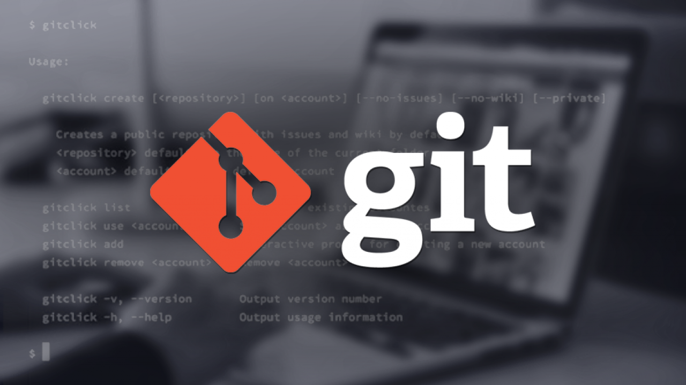

# История

Разработка ядра _Linux_ велась на проприетарной системе BitKeeper[8], которую автор — Ларри Маквой, сам разработчик _Linux_ — предоставил проекту по бесплатной лицензии. 

Разработчики, высококлассные программисты, написали несколько утилит, и для одной Эндрю Триджелл произвёл реверс-инжиниринг формата передачи данных _BitKeeper_. 

В ответ Маквой обвинил разработчиков в нарушении соглашения и отозвал лицензию, и Торвальдс взялся за новую систему: ни одна из открытых систем не позволяла тысячам программистов **кооперировать свои усилия** (тот же конфликт привёл к написанию _Mercurial_). 

Идеология была проста: взять подход CVS и перевернуть с ног на голову[9], и заодно добавить надёжности.

Начальная разработка **велась меньше, чем неделю**: 3 апреля 2005 года разработка началась, и уже 7 апреля код _Git_ управлялся неготовой системой. 16 июня _Linux_ был переведён на Git, а 25 июля Торвальдс отказался от обязанностей ведущего разработчика.